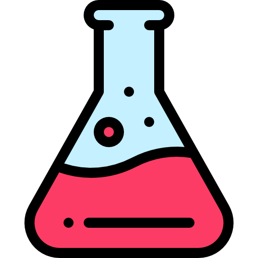
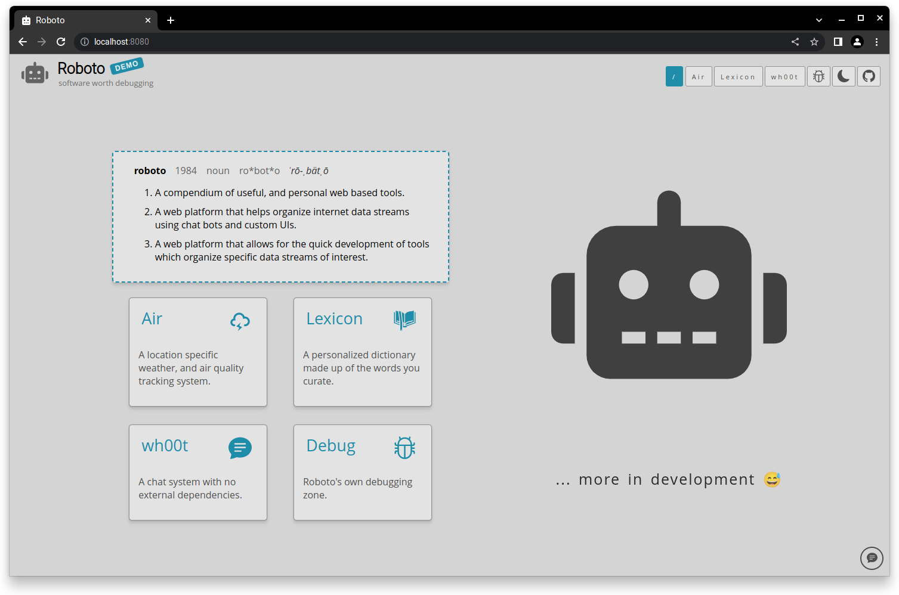
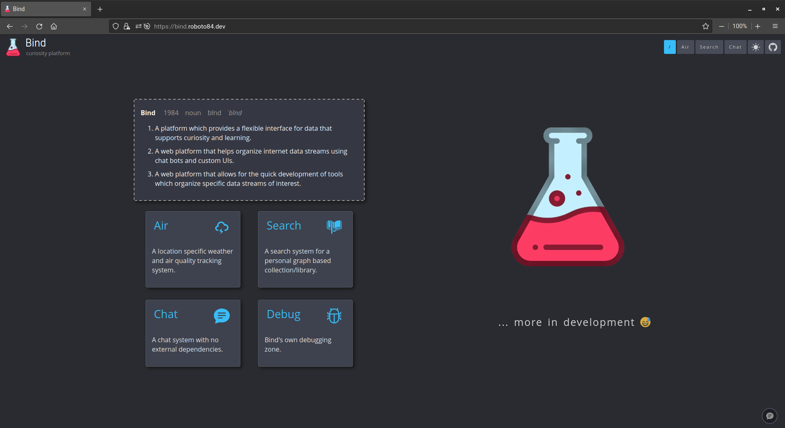

<h1 align="center">bind_ui</h1>

	

## About
`bind_ui` is the frontend for [Bind](https://github.com/roboto84/bind). Check out the `Bind` repository to learn 
more.

## Usage
To run `bind_ui` with all of its respective services (api, chat server, etc) goto the [Bind](https://github.com/roboto84/Bind) repo and follow its README.

 

	
     
    Light mode
      
    
     
    Dark mode

## Commit Conventions
Git commits follow [Conventional Commits](https://www.conventionalcommits.org) message style as explained in detail on their website.

 

    <a href="https://www.flaticon.com/free-icons/flask" target="_blank" title="flask icons">
        bind_ui icon created by Freepik - Flaticon
    </a>

