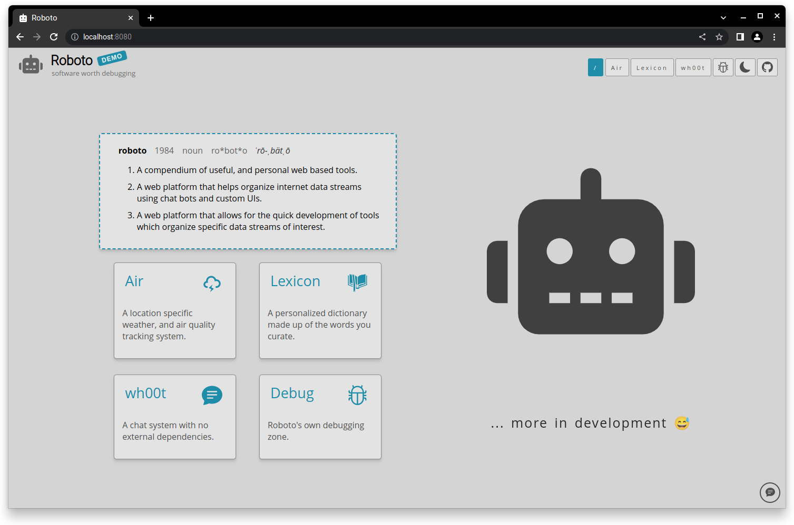
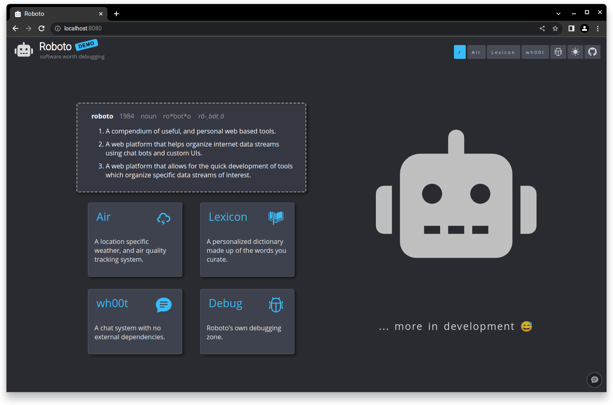

<h1 align="center">roboto_ui</h1>

	

## About
`roboto_ui` is the frontend for [roboto](https://github.com/roboto84/roboto). Check out the `roboto` repository to learn more.

## Usage
To run `roboto_ui` with all of its respective services (api, chat server, etc) goto the [roboto](https://github.com/roboto84/roboto) repo and follow its README.

 

	
     
    Light mode
      
    
     
    Dark mode

## Commit Conventions
Git commits follow [Conventional Commits](https://www.conventionalcommits.org) message style as explained in detail on their website.

 

    <a href="https://www.flaticon.com/free-icons/robot" target="_blank" title="robot icons">
        roboto_ui icon created by Freepik - Flaticon
    </a>

